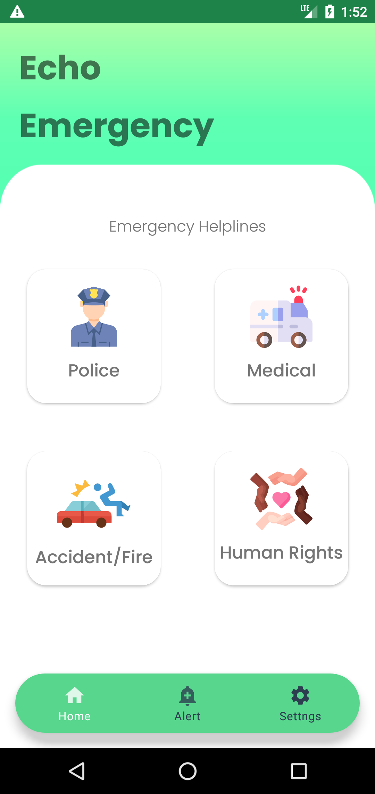
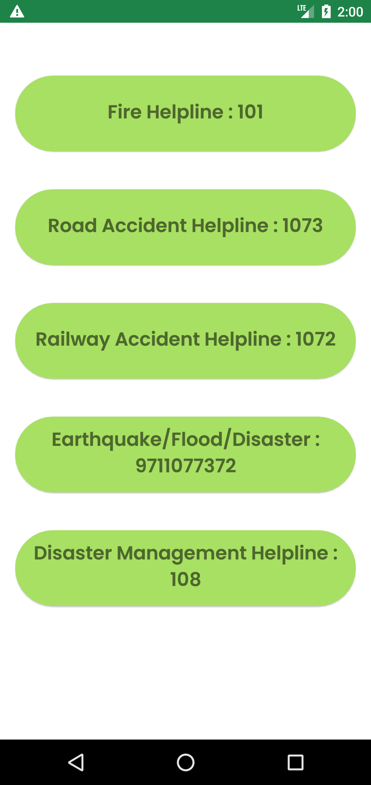
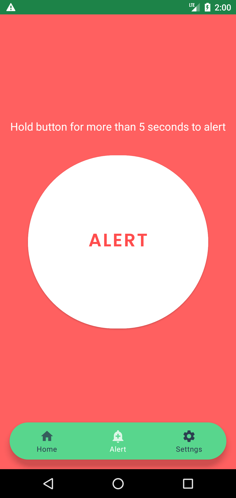
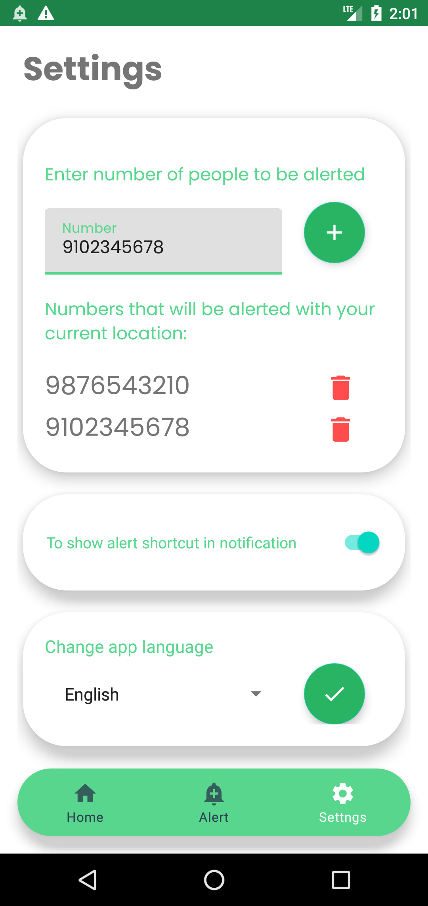
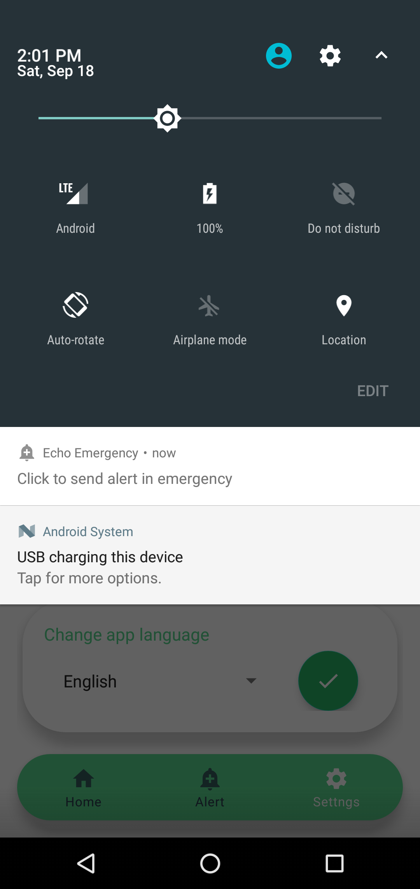

<h1 align="center">Echo Emergency</h1>
   
  

   
  
<h2 align="center">Features</h2>

- An android app which provides all important Indian emergency helpline numbers and a safety alert feature.
- Emergency numbers can be contacted quickly on press of a button.
- Pressing the alert button for 5 seconds sends a emergency message to numbers you added in settings.
- A constant notification shortcut to alert button can be enabled from settings.
- The whole application language can be switched between English or Hindi.
- Its uses Room database for saving numbers and implements MVVM architecture.

<h2 align="center">Screenshots</h2>

          
    
